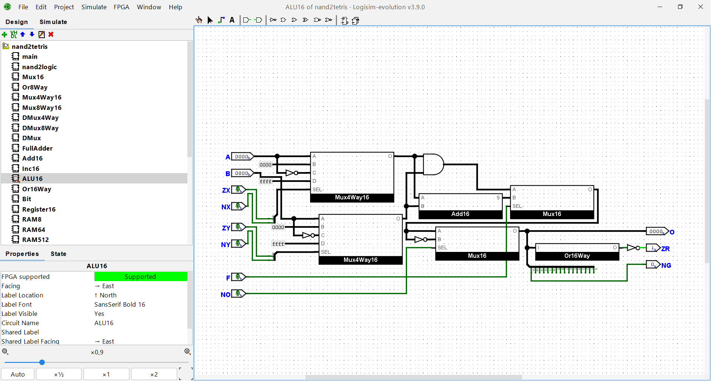

# nand2tetris-computer

**A complete Hack computer built from NAND gates and HDL components**

This repository contains my implementation of the [Nand2Tetris](https://www.nand2tetris.org/) course. It includes all core projects from Part I (Chapters 1–5), written in HDL and tested with the supplied tools, as well as a Logisim Evolution version of the complete Hack computer.

## 📁 Project Structure

```
nand2tetris-computer/
├── 01                # Chapter 1: Logic gates (HDL)
├── 02                # Chapter 2: Boolean arithmetic (HDL)
├── 03                # Chapter 3: Sequential logic (HDL)
├── 04                # Chapter 4: Machine language (ASM programs)
├── 05                # Chapter 5: Computer architecture (HDL)
├── nand2tetris.circ  # Full Hack computer in Logisim Evolution
├── logisim_project.png
└── README.md         # This file
```

## 🧠 What's Inside

* **Chapters 1–5 (01–05 folders)**
  HDL implementations of the core hardware elements, tested using the Nand2Tetris hardware simulator.

* **Chapter 4 (04 folder)**
  Assembler programs written in Hack machine language (`.asm`) to run on the simulated computer.

* **Logisim Evolution Project**
  A complete computer (CPU, memory, ALU) recreated in [Logisim Evolution](https://github.com/reds-heig/logisim-evolution), simulating the Hack architecture using only basic logic gates (from NAND upwards).

## 🚀 Getting Started

### Option 1: Run HDL components (Nand2Tetris Tools)

1. Download the [Nand2Tetris software tools](https://www.nand2tetris.org/software).
2. Open the Hardware Simulator.
3. Load `.hdl` files from folders `01` to `05`.
4. Use the provided `.tst` and `.cmp` files (if available) to verify functionality.

### Option 2: Simulate Full Computer in Logisim Evolution

1. Download [Logisim Evolution](https://github.com/reds-heig/logisim-evolution/releases).
2. Clone the repository:

   ```bash
   git clone https://github.com/Eugene2424/nand2tetris-computer.git
   cd nand2tetris-computer
   ```
3. Open `nand2tetris.circ` in Logisim Evolution.
4. Use input pins, ROM, and clock controls to simulate operations and explore how the system works.

## 📷 Preview




## ✅ Completed Tasks

* ✅ Logic gates from NAND (AND, OR, NOT, etc.)
* ✅ ALU and arithmetic units
* ✅ Flip-flops, registers, RAM chips
* ✅ Program counter and CPU
* ✅ Hack Assembly programs (Add, Max, etc.)
* ✅ Full computer in both HDL and Logisim Evolution

## 📘 Notes

This repository is a personal portfolio project based on the *Nand2Tetris* course. It’s intended for learning and demonstration purposes. Feel free to explore or fork it, but I’m not actively reviewing contributions.
